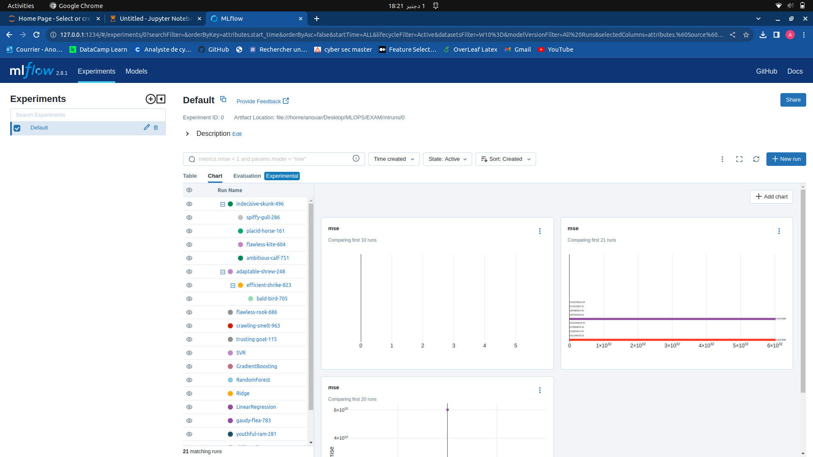
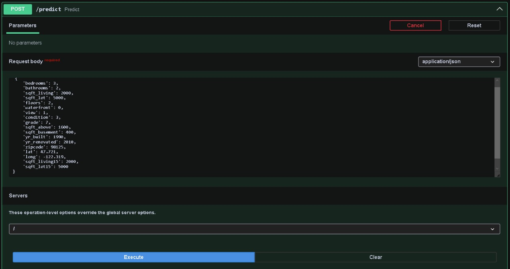
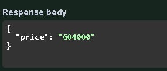
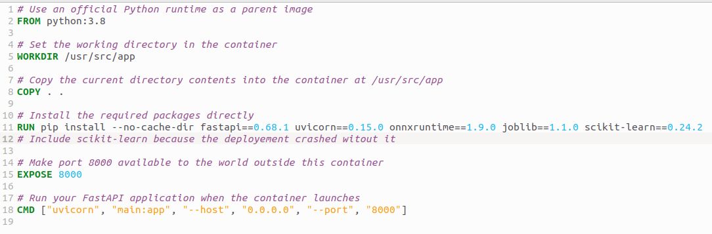
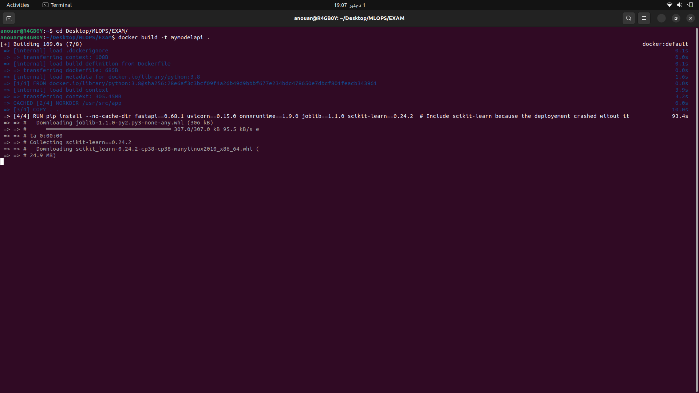
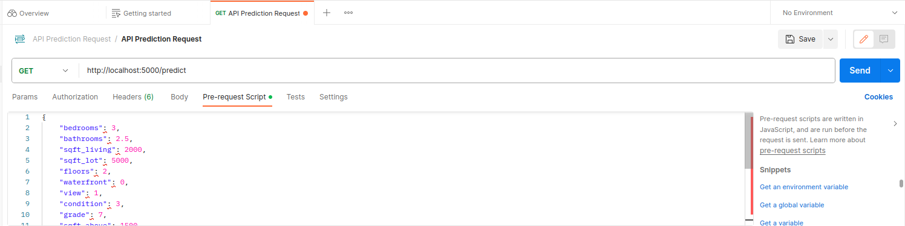

# Project Overview: Building a Scalable ML Model Deployment Pipeline

## Introduction:

In the evolving landscape of machine learning, deploying models efficiently and reliably is crucial. This project aims to create a streamlined pipeline for training, tracking, deploying, and consuming machine learning models using modern tools and frameworks.

The project leverages MLflow, a powerful open-source platform for managing the end-to-end machine learning lifecycle. It enables experimentation tracking, packaging code, and sharing models seamlessly. Additionally, FastAPI, a high-performance web framework for building APIs, serves as the bridge between the trained models and end-users, ensuring rapid and scalable model deployment.

## About Dataset
### King County, USA, House Sales Dataset

This dataset offers a comprehensive view of house sales within King County, USA, encompassing Seattle and its surrounding areas. It serves as a valuable resource for analyzing real estate trends, property valuations, and demographic shifts.

#### Detailed Features

- `ID`: Unique identifier for each property.
- `Date`: Date of the house sale.
- `Price`: Sale price of the house (target variable for predictive modeling).
- `Bedrooms`: Number of bedrooms.
- `Bathrooms`: Number of bathrooms, including half-bathrooms as decimals.
- `Sqft_Living`: Interior living space in square feet.
- `Sqft_Lot`: Land space in square feet.
- `Floors`: Number of floors in the house.
- `Waterfront`: Indicates if the property is on the waterfront (0 or 1).
- `View`: View quality index (0 to 4).
- `Condition`: Condition of the house (1 to 5).
- `Grade`: Overall grade of the house (1 to 13).
- `Sqft_Above`: Square footage of the house excluding the basement.
- `Sqft_Basement`: Basement area in square feet.
- `Yr_Built`: Year the house was built.
- `Yr_Renovated`: Year of the last renovation.
- `Zipcode`: ZIP code of the property.
- `Lat`: Latitude coordinate.
- `Long`: Longitude coordinate.
- `Sqft_Living15`: Average interior living space of the 15 closest neighbors.
- `Sqft_Lot15`: Average land lot size of the 15 closest neighbors.

#### Usage and Applications

- **Real Estate Valuation**: Analyze property price influencers.
- **Predictive Modeling**: Develop models to predict property prices.
- **Market Trend Analysis**: Study historical trends to predict future market movements.
- **Demographic Studies**: Correlate housing characteristics with geographic and demographic data.

#### Dataset Limitations and Considerations

- **Region Specific**: The dataset is specific to King County.
- **Time Sensitivity**: Market trends can change, making the data less relevant over time.
- **Data Integrity**: There may be instances of missing or inaccurate data.

## Project Objectives:

### Data Preprocessing and Model Training:

Utilize MLflow to preprocess data and train multiple machine learning models.
Track model performance, hyperparameters, and versions using MLflow's tracking capabilities.

### Model Serialization and Deployment:

Identify and save the best-performing model in ONNX format using MLflow.
Serialize preprocessing transformations using the transformers API and save in pickle format.

### FastAPI Integration for Model Serving:

Develop a FastAPI application to serve the serialized model.
Create robust API endpoints to accept input and provide model predictions in real-time.

### Containerization with Docker:

Package the FastAPI app, serialized model, and preprocessing transformations into a Docker container for easy deployment and scalability.

### Postman Validation and Flask Consumption:

Validate the APIs using Postman by sending requests and receiving predictions.
Develop a Flask application to consume the FastAPI-based model endpoints, showcasing a user-friendly interface for model consumption.

## Ml Flow
Here is a screenshot of the mlflow logging accuracy results :

## Fastapi
Here is screenshots of an input prediction in fastapi :

## Harnessing Docker for Containerization

## Utilizing Postman for API Testing

## Flask

Here is screenshots of an input prediction in flask and its index html form :

# Conclusion:

This project aims to demonstrate a comprehensive approach to building, deploying, and consuming machine learning models. By leveraging MLflow's tracking capabilities, FastAPI's efficient API development, and Docker's containerization, the project illustrates a robust deployment pipeline for machine learning models, ensuring scalability, reliability, and ease of consumption for end-users.
